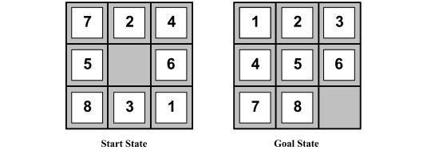

# 8-Puzzle Solver

Solving the classic 3×3 sliding-tile puzzle with A* search and a
Manhattan-distance heuristic.

## Problem

A 3×3 grid holds tiles 1–8 and one blank space. Tiles are moved into the
blank space to reach the ordered goal state below in as few moves as
possible.



To solve it we define:

- **State** — a 3×3 arrangement of tiles 1–8 and `E` (empty).
- **Actions** — slide the tile above/below/left/right of the blank into it.
- **Goal test** — does the state match the goal grid above?
- **Path cost** — 1 per move.
- **Heuristic** — sum of Manhattan distances of every tile from its goal
  position, used to guide A* search.

## Approach

Implementation: [`eight_puzzle.py`](./eight_puzzle.py), using
[`simpleai`](https://github.com/simpleai-team/simpleai)'s A* search.

## Result

Starting from a scrambled configuration with a known solution depth of 8
moves, A* finds the goal in **22 moves** (accounting for the actual path
taken through the search space), printing the full move-by-move solution:

```
Initial configuration
1-4-2
5-E-8
3-6-7

Step 1: After moving 4 into the empty space
...
Step 22: After moving 8 into the empty space
1-2-3
4-5-6
7-8-E
Goal achieved!
```

## Discussion

The Manhattan-distance heuristic is admissible (it never overestimates the
true remaining cost), which guarantees A* finds an optimal solution while
still exploring far fewer states than an uninformed search like BFS would
need for the same puzzle.

## Running

```bash
pip install -r requirements.txt
python eight_puzzle.py
```
