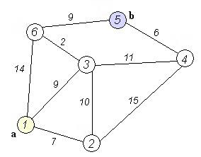

# Route Planning

Finding the optimal route between two cities on a weighted graph, comparing
uninformed search strategies (breadth-first, depth-first, and uniform-cost
search).

## Problem

Six cities are connected by roads of known cost (see graph below). The goal
is to find the optimal route between city 1 and city 5.



To solve it we define:

- **State** — the current city (nodes 1–6).
- **Actions** — travel to any directly connected city.
- **Goal test** — is the current city equal to city 5?
- **Path cost** — the sum of edge weights, taken from a 6×6 distance
  matrix (`0` for self, `inf` for unconnected cities).

## Approach

Implementation: [`route_planning.py`](./route_planning.py), using
[`simpleai`](https://github.com/simpleai-team/simpleai)'s built-in BFS,
DFS, and uniform-cost search.

## Result

```
The BFS route is [1, 6, 5], and total cost is 23
The DFS route is [1, 6, 5], and total cost is 23
The UCS route is [1, 3, 6, 5], and total cost is 20
```

## Discussion

All three algorithms return *a* path from city 1 to city 5, but only
**uniform-cost search** finds the truly optimal path (cost **20**).
Breadth-first and depth-first search both return a valid but sub-optimal
path (cost 23) because neither considers edge weights when choosing which
node to expand next. When path cost matters and edge weights vary,
uniform-cost search is the right tool; for unweighted or uniformly-weighted
graphs, BFS/DFS are cheaper alternatives.

## Running

```bash
pip install -r requirements.txt
python route_planning.py
```
